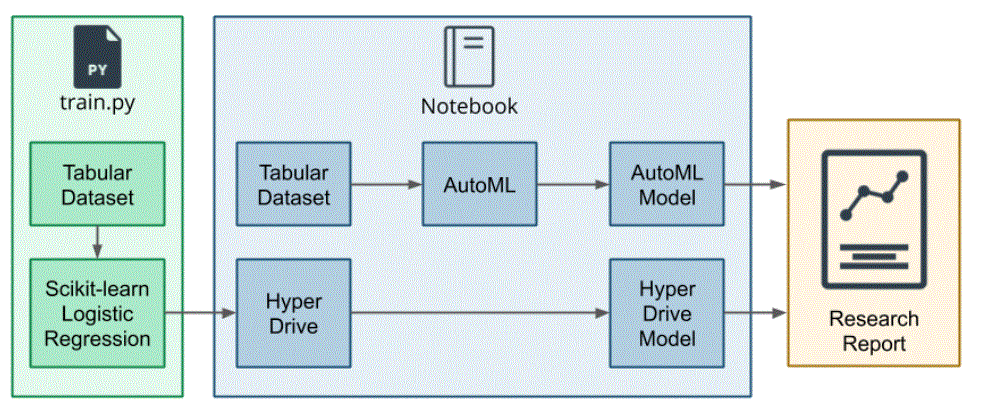
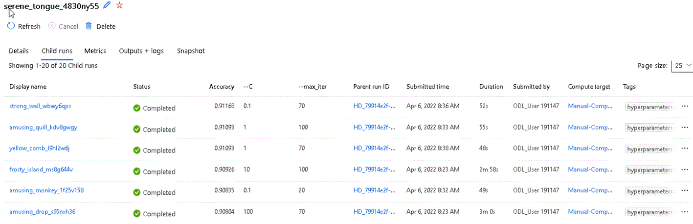
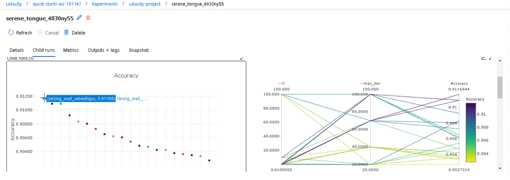
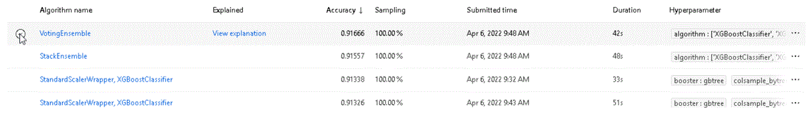
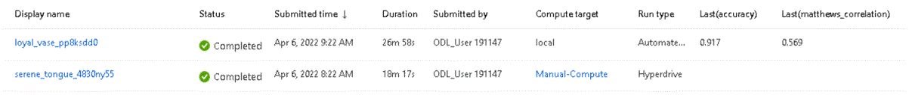
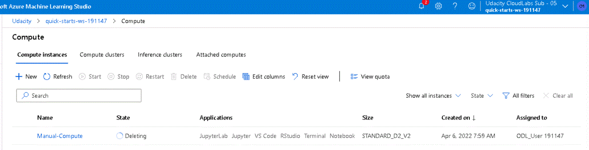

# Optimizing an ML Pipeline in Azure

## Overview
This project is part of the Udacity Azure ML Nanodegree.
In this project, we build and optimize an Azure ML pipeline using the Python SDK and a provided Scikit-learn model.
This model is then compared to an Azure AutoML run.

## Summary
In this project, we use (part of) the Bank Marketing Data Set from the UCI Machine Learning Repository. The data is related with direct marketing campaigns of a Portugese banking institution. ([More info can be found here](https://archive.ics.uci.edu/ml/datasets/Bank+Marketing)). We seeq to predict the output variable y of this dataset, which denotes whether the client subscribed a term deposit (yes or no).

In this report, we perform two methods of create a model for this. In the first part, we use HyperDrive to optimize a Logistic Regression Model. This results in an Accuracy of 91.168 % with the hyperparameters C = 0.1 and max_iter = 70. In the second part we use Azure's AutoML to find an optimal Model. Here the best performing model was a VotingEnsemble model with an accuracy of 91.17 %.

## Scikit-learn Pipeline

The main steps that are being taken are shown in the diagram below. 

For the first method, the train.py python file contains a script that performs a Scikit-learn Logistic Regression Algorithm, which will be connected to the HyperDrive for the optimization of the hyperparameters to give the most optimal HyperDriveModel. 

In the second approach, the Tabular Dataset is directly fed into the Azure AutoML, which will compare many models before reaching the most optimal model.

For the HyperDrive tuning, the parameter C was taken as one of the following 5 values: 0.01, 0.1, 1, 10 and 100. The max_iter parameter can have one of the following 4 parameters: 20,40,70,100. So in total 5x4 =20 runs are being investigated. For the parameter C a logarithmic range has been used, due to the nature of this parameter. This was not needed for the second parameter.

Furthermore, we use an early termination policy, to prevend that the optimization would continue without getting a better accuracy. The most optimal run had an accuracy of 91.168 %.

## AutoML

The model found by the AutoML mechanism is a VotingEnsemble of 6 different classifiers (like XGBoostClassifier, LightGBM, XGBoostClassifier and SGD). The accuracy of this compounded model was 91.17 %.

## Pipeline comparison

The accuracies of the two calculated models are very comparable. But note that the AutoML model is more complex, since it consists of 6 different models.  The running time of the two models is comparable, although the first one is a bit faster 18 minutes compared to the 27 miutes for AutoML.

## Future work

There are many areas of improvement for this model. For instance, one can do the hyperparameter method also for other models. For instance, one can use it on the XGBoostClassifier that the AutoML found. And these can then be compared to the results that we have found here. These type of more broader investigations can potentially further improve the accuracy.

## Proof of cluster clean up
After I ran both models and after taking screenshots and inspecting the results, I deleted the compute node, as can be seen in the below picture.

## Useful Resources
All links below come from a 1883 page document describing Azure ML and contains a lot of information. Everyone that is working with Azure ML should have the link to this document:
- [ScriptRunConfig Class](https://docs.microsoft.com/en-us/python/api/azureml-core/azureml.core.scriptrunconfig?view=azure-ml-py)
- [Configure and submit training runs](https://docs.microsoft.com/en-us/azure/machine-learning/how-to-set-up-training-targets)
- [HyperDriveConfig Class](https://docs.microsoft.com/en-us/python/api/azureml-train-core/azureml.train.hyperdrive.hyperdriveconfig?view=azure-ml-py)
- [How to tune hyperparamters](https://docs.microsoft.com/en-us/azure/machine-learning/how-to-tune-hyperparameters)
- [How to run a notebook](https://docs.microsoft.com/en-us/azure/machine-learning/how-to-run-jupyter-notebooks#run-a-notebook-or-python-script)
- [The Markdown guide](https://about.gitlab.com/handbook/markdown-guide/)
